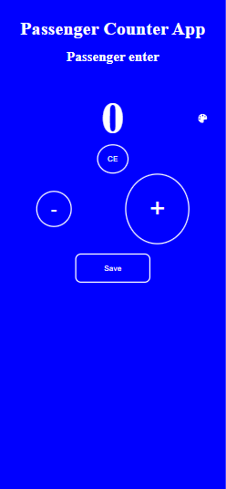
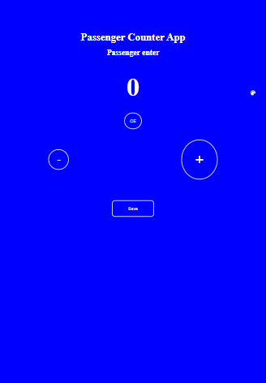
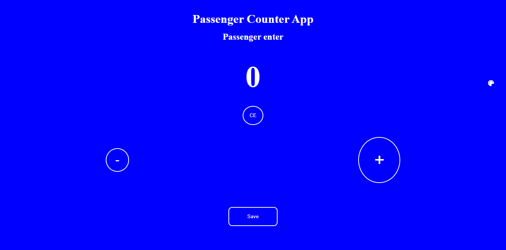

# 30days of React- day 07 

After going through [30 days of React day 8](https://github.com/Asabeneh/30-Days-Of-React/blob/master/08_Day_States/08_states.md), I decidedd to build scrimba passenger counter app using react class components and states. This exercise challenges help you improve the use of class components, using props and this.state by building projects.

## Table of contents

- [Overview](#overview)
  - [The challenge](#the-challenge)
  - [Screenshot](#screenshot)
  - [Links](#links)
- [My process](#my-process)
  - [Built with](#built-with)
  - [Proud of this](#proud-of-this)
  - [Continued development](#continued-development)
- [Author](#author)

## Overview

### The challenge

Users should be able to:

- View the optimal layout for the site depending on their device's screen size

### Screenshot





### Links

- Solution URL: (https://github.com/ibimina/passenger-counter)
- Live Site URL: (https://ibimina.github.io/passenger-counter/)

## My process

### Built with

- Create react app
-  created and export Header,Main,Button class component 
- created functions in the app.js that increase and decrease the passenger count when the plus or minus button is clicked
- created function that changes the passenger count to zero when the CE button is clicked
- created a function that saves the passenger count when the save buton is clicked and displays the passenger count and the previous counts
- imported reacticons 
- Rendered App component
- CSS custom properties
- Flexbox
- CSS Grid
- Mobile-first workflow

### Proud of this

#### How to import icons from react 
- npm install react-icons
- import { FaPalette(IconName) } from "react-icons/fa";
- call it in the file needed

```jsx
<FaPalette/>

```

#### This  function changes the background color of the page and buttons
```jsx
changeColor=()=>{
  let r = Math.random()* 255;
   let g = Math.random() * 255;
    let b = Math.random() * 255;
    let rgb = `rgb(${r},${g},${b})`
    this.setState({ background: rgb})
}
```


### Continued development

React framework


## Author

- Ibimina Hart
 - Frontend Mentor - [ibimina](https://www.frontendmentor.io/profile/ibimina)
 - Linkedin - [ibimina hart](https://www.linkedin.com/in/ibimina-hart)
- Twitter - [ibiminaaH](https://www.twitter.com/ibiminaaH)
